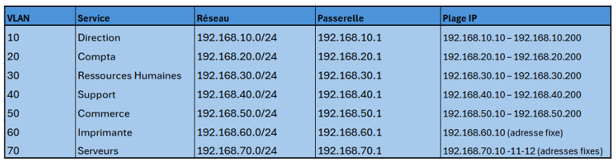

# Projet Infrastructure IT – GreenReso

## Contexte
Projet réalisé dans un environnement de laboratoire visant à mettre en place
et sécuriser une infrastructure informatique complète pour l’entreprise GreenReso.

## Objectif
- Mettre en place une architecture réseau segmentée (VLAN)
- Installer un serveur Windows Server 2022
- Mettre en place un Active Directory
- Créer des utilisateurs, des postes et des GPO
- Création de script Powershell pour automatiser les taches
- Réalisation de divers test d'intrusion pour renforcer la sécurité

## Environnement
- Windows Server 2022 (machine virtuelle)
- Active Directory, DNS, DHCP
- pfSense pour le routage inter-VLAN
- Postes clients Windows

## Travail réalisé
- **Segmentation réseau avec VLAN :**
   Le réseau de GreenReso à été segmenter en fonctions de ces 5 different services pour des questions de claireter et de sécurité :
  
  
- Installation de Windows Server 2022
- Création du domaine Active Directory
- Mise en place des services DNS et DHCP
- Création des utilisateurs et des groupes
- Application de stratégies de groupe (GPO)
- Automatisation des taches via des scripts PowerShell

## En cours
- Amélioration de la sécurité Active Directory
- Tests de sécurité en laboratoire
